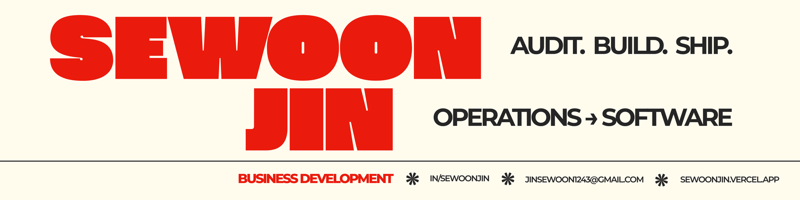

Quality Control at an automotive Tier-1 supplier in Pontiac, Michigan — 
where I digitized the paper checksheets I had been filling out by hand.

 

 

## Built for the floor

The first four were built for a working automotive plant and used by the people on it —
production supervisors, quality inspectors, and the IT team that now maintains them with me.
The last one started as a university GIS study and was rebuilt as a reproducible pipeline.

| | Project | What it does | Stack |
|:--:|---|---|---|
| 🗒️ | **[qc-checklist](https://github.com/sw1243-spec/qc-checklist)** | Replaces paper QC checksheets — reusable templates, per-part spec validation, SPC control charts, 3-shift tracking, corrective-action photo logs, daily email reports | `Next.js` `Prisma` `SQL Server` |
| 🕐 | **[ShiftScheduler](https://github.com/sw1243-spec/ShiftScheduler)** | Desktop shift-scheduling app for production teams, with an optional API backend | `Python` `Tkinter` `FastAPI` |
| 🌐 | **[WorkInstruction-Translator](https://github.com/sw1243-spec/WorkInstruction-Translator)** | Batch-translates DOCX / PPTX / XLSX / PDF work instructions with a shared terminology glossary | `Python` `DeepL` `OpenAI` |
| 📊 | **[VBA-Macro-for-QC](https://github.com/sw1243-spec/VBA-Macro-for-QC)** | Six recurring Excel reports automated — downtime, debit, scrap, rework, LPA scheduling | `Excel VBA` |
| 🗺️ | **[seoul-smoking-booth-siting](https://github.com/sw1243-spec/seoul-smoking-booth-siting)** | Ranks where Seoul should install outdoor smoking booths — random-forest feature importance over a 500 m grid, reproducible end to end | `Python` `GeoPandas` `scikit-learn` |

> **On the public versions** — features match what runs internally, but every customer name, part number,
> and tolerance has been replaced with demo values. Nothing confidential ships in these repos.

 

## Off the floor

Spatial analysis from my Big Data Convergence coursework — kept as a pipeline that still runs,
not a slide deck.

| | Project | What it does | Stack |
|:--:|---|---|---|
| 🗺️ | **[seoul-smoking-booth-siting](https://github.com/sw1243-spec/seoul-smoking-booth-siting)** | Ranks where Seoul should install outdoor smoking booths — random forest feature importance weights a 500 m grid of 298 candidate cells, minus the no-smoking buffer zones around schools, clinics and transit | `Python` `GeoPandas` `scikit-learn` |

 

## Stack

 

## Background

**Hansae Mobility USA** — Pontiac, Michigan
Quality Control Intern (Jan–Jun 2026), then retained as an independent contractor.
Ran line audits and document control by day; built the tools that replaced them.

**Pukyong National University** — Busan, Korea
International Business & Big Data Convergence, double major · Class of 2027
Exchange: Georgia College & State University · Wayne State University, Detroit

**Awards**
Excellence Award, company-wide AI Utilization Contest — Hansae Mobility (2026)
1st Prize, BITLO Trade & Logistics Competition — Busan Development Institute & Busan Port Authority (2024)

 

Currently building software for a U.S. manufacturer, remotely from Busan.

